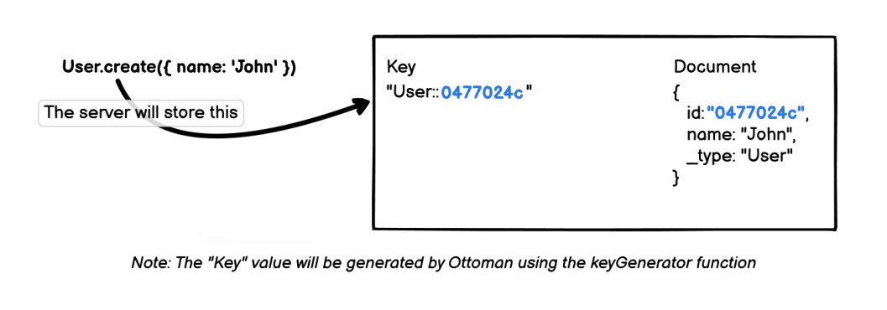
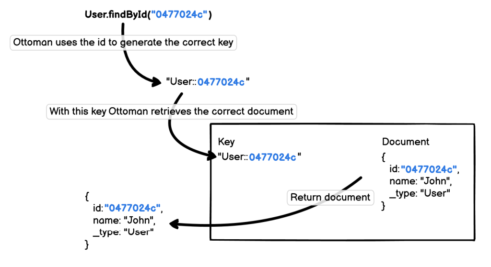

# How Ottoman Works

This section is for those who want to understand how Ottoman works in depth.

## Key Generation Layer

Ottoman provides an abstraction layer to handle the `keys` that will be used to store/access the documents on the Database Server.

Developers will only have to work with the `document` ids while ottoman handles the keys automatically for them.

### `keyGenerator` function

The default `keyGenerator` function is used to generate all keys by Ottoman in your Couchbase datastore.

```javascript
const keyGenerator = ({ metadata }) => `${ metadata.modelName }`
```

Using the default `keyGenerator` function that Ottoman provides and assuming your `modelName` is 'User', the key for your document would look like:

- `User::0477024c`

:::tip Notice
This resulted key is a combination of the prefix as provided by the default  `keyGenerator` function (`${metadata.modelName}`) [appended with an ID](/docs/basic/model.html#model-id) (`0477024c`).
:::

#### Override `keyGenerator` function

The `keyGenerator` function allows you to only override the prefix for a key, or completely remove the prefix such that the key always matches the ID of the document generated.

```javascript
const keyGenerator = ({ metadata }) => `${ metadata.scopeName }`
const User = model('User', schema, { keyGenerator, scopeName: 'myScope' })
```

In this example we are overriding the `keyGenerator` function and replacing the `${metadata.modelName}` with `${metadata.scopeName}`. Using this override, the key for your document would look like:

- `myScope::0477024c`

To understand how ID differs from keys in Ottoman we need to explore creating a model, understand how Ottoman deals with IDs which affect your key and then how to retrieve your document by ID.

#### Defining a `Model`

```javascript
...
const userSchema = new Schema({ name: string });
const User = model('User', userSchema);
```

1. Set your rules in the `Schema`.
2. Now you can create your `Model` with the `Schema` defined.

#### Creating a Document

Let see how Ottoman handles a new document creation.



:::tip Notice
Using Ottoman you only need to think about `id` in order to execute CRUD Operations over documents.
All the `key` management will be automatically handled by Ottoman.
:::

#### Retrieving a Document

Ottoman provides a `findById` method at the `Model` level to retrieve a document by `id`. See the picture below to understand how it works.



## Ottoman vs NodeJS SDK

In this section we will be reviewing some methods of the Ottoman Model, and comparing them with their respective implementation in the Couchbase NodeJs SDK.

The environment on which these tests were run has the following characteristics:

| Info        |  Properties  |
| ----------- | -------------- |
| Processor   |   Intel(R) Core(TM) i7-9750H CPU @ 2.60GHz |
| RAM         |   16.0 GB |
| System type |   64-bit operating system, x64-based processor |
| Storage     |   SSD 500GB|
| SO          |   Windows 10  |
| **_Couchbase_**   |   Enterprise Edition 7.0.0 |
| **_Couchbase Node.js SDK_**  |   v3.2.2 |
| **_Ottoman_** |   v2.0.0-beta.9 |

:::tip About metrics
For metrics we run each example around a thousand times and take the average tests run time and [heapUsed*](https://nodejs.org/api/process.html#process_process)
##### **heapUsed*: is the actual memory used during the process execution, according to the documentation, the memory used by "C++ objects bound to JavaScript objects managed by V8"
:::


### Ottoman Schema and Model Definitions

We will use the data model corresponding to the type of `airport` collection, within the `travel-sample` bucket and scope `inventory`.

```ts
// Define Geolocation Schema will be part of Airport Schema
const GeolocationSchema = new Schema({
  alt: Number,
  lat: { type: Number, required: true },
  lon: { type: Number, required: true },
  accuracy: String,
});

// Define Airport Schema
const AirportSchema = new Schema({
  airportname: { type: String, required: true },
  city: { type: String, required: true },
  country: { type: String, required: true },
  faa: String,
  geo: GeolocationSchema,
  icao: String,
  tz: { type: String, required: true },
});
```

Our model would look like this:

```typescript
// Define Airport model instance
const AirportModel = model(
  'airport', // Model name (collection)
  AirportSchema, // Schema defined
  {
    modelKey: 'type', // Ottoman by default use `_type`
    scopeName: 'inventory', // Collection scope
    keyGeneratorDelimiter: '_', // By default Ottoman use ::
  });
```

### Ottoman vs. SDK Connection

Create our Ottoman instance and connect:

```typescript
const ottoman = new Ottoman();
await ottoman.connect({
  connectionString: 'couchbase://127.0.0.1',
  bucketName: 'travel-sample',
  username: 'Administrator',
  password: 'password',
});
```

Couchbase NodeJs SDK cluster definition:

```typescript
const cluster = new couchbase.Cluster('couchbase://127.0.0.1', {
  username: 'Administrator',
  password: 'password',
});

const bucket = cluster.bucket('travel-sample');
const collection = bucket.scope('inventory').collection('airport');
```

### Model *[find](/docs/api/interfaces/imodel.html#find)*

- Let's see a simple filterless search implementation.

#### SDK:

```typescript
const query = `
  SELECT *
  FROM \`travel-sample\`.\`inventory\`.\`airport\`
  WHERE type = "airport"
  LIMIT 1;
`;
try {
  const result = await cluster.query(query);
  console.log('Result:', JSON.stringify(result.rows, null, 2));
} catch(error) {
  console.error('Query failed: ', error);
}
```

#### Ottoman:

```typescript
try {
  const result = await AirportModel.find({}, { limit: 1 });
  console.log('Result:', JSON.stringify(result.rows, null, 2));
} catch(error) {
  console.error('Query failed: ', error);
}
```

Output:

```sh
Result: [
  {
    "airport": {
      "id": 1254,
      "type": "airport",
      "airportname": "Calais Dunkerque",
      "city": "Calais",
      "country": "France",
      "faa": "CQF",
      "icao": "LFAC",
      "tz": "Europe/Paris",
      "geo": {
        "lat": 50.962097,
        "lon": 1.954764,
        "alt": 12
      }
    }
  }
]
```

:::tip Metrics
|      Library       |  Time (*ms*)  | Heap Use (*MB*) |
| ----------- |--------------:| --------:|
| Ottoman     |   6.8 |  9.1 |
| NodeJs SDK  |     6 |  9.6 |
:::

- Now using some conditions and sort:

#### SDK:

```typescript
const query = `
  SELECT airportname
  FROM \`travel-sample\`.\`inventory\`.\`airport\`
  WHERE
    country = "France" AND
    airportname LIKE "Aix%" AND
    type = "airport"
  ORDER BY airportname ASC
`;
try {
  const result = await cluster.query(query);
  console.log('Result:', JSON.stringify(result.rows, null, 2));
} catch(error) {
  console.error('Query failed: ', error);
}
```

#### Ottoman:

```typescript
try {
  const result = await AirportModel.find(
    { country: 'France', airportname: { $like: 'Aix%' } },
    { select: ['airportname'], sort: { airportname: 'ASC' } },
  );
  console.log('Result:', JSON.stringify(result.rows, null, 2));
} catch (error) {
  console.error('Query failed: ', error);
}
```

Output:

```sh
Result: [
  {
    "airportname": "Aix Les Bains"
  },
  {
    "airportname": "Aix Les Milles"
  }
]
```

:::tip Metrics
|      Library      |  Time (*ms*)  | Heap Use (*MB*) |
| ----------- |--------------:| --------:|
| Ottoman     | 3.47 |  9.1 |
| NodeJs SDK  | 3.43 |  9.78 |
:::

### Model *[findOneAndUpdate](/docs/api/interfaces/imodel.html#findoneandupdate)*

#### SDK:

```typescript
const query = `
  SELECT META().id as id
  FROM \`travel-sample\`.\`inventory\`.\`airport\`
  WHERE airportname LIKE "Aix Les Bains%"
    AND type = "airport"
  LIMIT 1
`;

try {
  const response = await cluster.query(query);
  const key = response.rows[0].id;
  const { cas, value } = await collection.get(key);

  await collection.replace(key,
    { ...value, airportname: 'Aix Les Bains Updated' },
    { cas }
  );
  const result = await collection.get(key);
  console.log('Result:', JSON.stringify(result.content, null, 2));
} catch (error) {
  console.error('Query failed: ', error);
}
```

#### Ottoman:

```typescript
try {
  const result = await AirportModel.findOneAndUpdate(
    { airportname: { $like: 'Aix Les Bains%' } },
    { airportname: 'Aix Les Bains Updated' },
    { new: true }, // To get updated object
  );
  console.log('Result:', JSON.stringify(result, null, 2));
} catch (error) {
  console.error('Query failed: ', error);
}
```

Output:

```sh
Result: {
  "airportname": "Aix Les Bains",
  "city": "Chambery",
  "country": "France",
  "faa": "CMF",
  "geo": {
    "lat": 45.63805,
    "lon": 5.880225,
    "alt": 779
  },
  "icao": "LFLB",
  "id": 1329,
  "tz": "Europe/Paris",
  "type": "airport"
}
```

:::tip Metrics
|     Library        |  Time (*ms*)  | Heap Use (*MB*) |
| ----------- |--------------:| --------:|
| Ottoman     | 10.08 | 10.49 |
| NodeJs SDK  | 11.06 |  7.95 |
:::

### Model *[findOneAndRemove](/docs/api/interfaces/imodel.html#findoneandremove)*

#### SDK:

```typescript
const query = `
      SELECT META().id as id
      FROM \`travel-sample\`.\`inventory\`.\`airport\`
      WHERE airportname LIKE "Aix Les Bains%"
        AND type = "airport"
      LIMIT 1
    `;

try {
  const response = await cluster.query(query);
  const key = response.rows[0].id;
  const { cas } = await collection.get(key);
  const result = await collection.remove(key, { cas });
  console.log(`RESULT: `, result);
} catch (error) {
  console.error('Query failed: ', error);
}
```

Output:

```sh
RESULT:  MutationResult {
  cas: CbCas { '0': <Buffer 00 00 09 f4 de 87 a2 16> },
  token: undefined
}
```

#### Ottoman:

In Ottoman using `findOneAndRemove` method we will have the document deleted as a result:

```typescript
try {
  const result = await AirportModel.findOneAndRemove(
    { airportname: { $like: 'Aix Les Bains%' } }
  );
  console.log('Result:', JSON.stringify(result, null, 2));
} catch (error) {
  console.error('Query failed: ', error);
}
```

Output:

```sh
Result: {
  "airportname": "Aix Les Bains",
  "city": "Chambery",
  "country": "France",
  "faa": "CMF",
  "geo": {
    "lat": 45.63805,
    "lon": 5.880225,
    "alt": 779
  },
  "icao": "LFLB",
  "id": 1329,
  "tz": "Europe/Paris"
}
```

:::tip Metrics
|      Library       |  Time (*ms*)  | Heap Use (*MB*) |
| ----------- |--------------:| --------:|
| Ottoman     | 11.44 | 11.047   |
| NodeJs SDK  | 14.86 |  7.95* |
:::

## Bulk Operations

Bulk operations describes how to operate on more than one document at the same time, this is a way to increasing network performance in to pipeline operations with [`Batching Operations`](https://docs.couchbase.com/nodejs-sdk/current/howtos/concurrent-async-apis.html#batching). As Node.js inherently performs all operations in an asynchronous manner, no special implementation is required in order to enable batching. Simply perform a number of operations simultaneously, and they will be batched on the network. This happens internally and is highly efficient. Let's see in action with Ottoman and Node SDK:

### Create Many Documents

For our example implementation we will use `bulkAirportDocs` array as defined next:

```typescript
const bulkAirportDocs = [
  {
    airportname: 'Airport test 1',
    city: 'City A1',
    country: 'Country A1',
    faa: 'CA1',
    geo: {
      lat: 0.0,
      lon: 0.0,
      alt: 0,
    },
    icao: 'CAC1',
    tz: 'Europe/Paris',
  },
  {
    airportname: 'Airport test 2',
    city: 'City A2',
    country: 'Country A2',
    faa: 'CA2',
    geo: {
      lat: 0.0,
      lon: 0.0,
      alt: 0,
    },
    icao: 'CAC2',
    tz: 'Europe/Paris',
  },
];
```

#### SDK

In the next example we will be using [Insert](https://docs.couchbase.com/nodejs-sdk/current/howtos/kv-operations.html#crud-operations) operation for write a JSON document with a given ID (key) to the database applying batching operation strategy:

```typescript
// Note that this behaviour extends to the world of async/await,
// such that following would be automatically batched across the network:
try {
  const result = await Promise.all(
    bulkAirportDocs.map(async (doc) => {
      await collection.insert(`airport_${ doc.id }`, doc);
      const newDoc = await collection.get(`airport_${ doc.id }`);
      return newDoc.content;
    }),
  );
  console.log(`RESULT: `, JSON.stringify(result, null, 2));
} catch(error) {
  console.error('Query failed: ', error);
}
```

Output:

```sh
[
  {
    "id": "b6027254-7071-4e76-9303-aa18f3b93bcd",
    "airportname": "Airport test 1",
    "city": "City A1",
    "country": "Country A1",
    "faa": "CA1",
    "geo": {
      "lat": 0,
      "lon": 0,
      "alt": 0
    },
    "icao": "CAC1",
    "tz": "Europe/Paris"
  },
  {
    "id": "d4331304-e321-45cb-89d2-23530240b9bd",
    "airportname": "Airport test 2",
    "city": "City A2",
    "country": "Country A2",
    "faa": "CA2",
    "geo": {
      "lat": 0,
      "lon": 0,
      "alt": 0
    },
    "icao": "CAC2",
    "tz": "Europe/Paris"
  }
]
```

#### OTTOMAN

The way to do the same example above in Ottoman is as simple as using Model's [createMany](/docs/advanced/how-ottoman-works.html#bulk-operations) function as we can see below:

```typescript
try {
  const result = await AirportModel.createMany(bulkAirportDocs);
  console.log(JSON.stringify(result, null, 2));
} catch (error) {
  console.error('Query failed: ', error);
}
```

Output:

```sh
{
  "status": "SUCCESS",
  "message": {
    "success": 2,
    "match_number": 2,
    "errors": [],
    "data": [
      {
        "airportname": "Airport test 1",
        "city": "City A1",
        "country": "Country A1",
        "faa": "CA1",
        "geo": {
          "lat": 0,
          "lon": 0,
          "alt": 0
        },
        "icao": "CAC1",
        "tz": "Europe/Paris",
        "id": "b6027254-7071-4e76-9303-aa18f3b93bcd",
        "type": "airport"
      },
      {
        "airportname": "Airport test 2",
        "city": "City A2",
        "country": "Country A2",
        "faa": "CA2",
        "geo": {
          "lat": 0,
          "lon": 0,
          "alt": 0
        },
        "icao": "CAC2",
        "tz": "Europe/Paris",
        "id": "d4331304-e321-45cb-89d2-23530240b9bd",
        "type": "airport"
      }
    ]
  }
}
```

### Conclusions

As can be appreciated for most of the search operations through filters in the Couchbase SDK, we must define our N1QL sentences while Ottoman internally takes care of it. Ottoman provides a method of interacting with a database using an object-oriented language, although it also allows the direct use of N1QL queries. Developers can interact with the database without becoming an expert in N1QL, which can save time and keep code streamlined, especially when is not that familiar with N1QL language, eliminating repetitive code and reducing the time taken in repetitive development tasks such as changes to the object model would be made in one place. The Ottoman abstraction layer allows us to focus exclusively on the use of the ODM and leave the management and interaction of the low-level database to it, however, insulates the developer from that layer, at times can potentially make it difficult to solve low-level problems.
