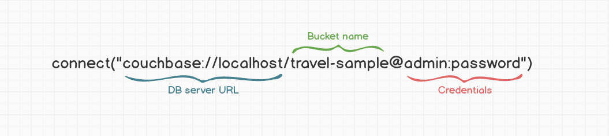

# Ottoman Class

## Defining an Ottoman Instance

```typescript
import { Ottoman } from "./ottoman";

const ottoman = new Ottoman();
```

Ottoman's instances are the backbone of Ottoman.js and the entry point to use the ODM in your app.

## Ottoman Constructor Options

Ottoman allows you to modify it's settings, this is useful for database modeling or migration.
One example is changing the metadata key to define the model in your documents.

```typescript
import { Ottoman } from "./ottoman";

const ottoman = new Ottoman({
  modelKey: 'type'
});
```

The `modelKey` default value is set to `_type`, but maybe you want to change it to `type` as it's described in the example above.

The available configurations are:

```typescript
interface OttomanConfig {
  collectionName?: string;
  scopeName?: string;
  idKey?: string;
  modelKey?: string;
  populateMaxDeep?: number;
  consistency?: SearchConsistency;
  maxExpiry?: number;
  keyGenerator?: (params: { metadata: ModelMetadata }) => string;
  keyGeneratorDelimiter?: string;
}
```

- `collectionName`: Store value to use for each Model if not provided. Default: Model's name
- `scopeName`: Store value to use for each Model if not provided. Default: `_default`
- `idKey`: Value of the key to save your **id**. Default: Document's `id`
- `modelKey`: Key to store the model name into the document. Default: `_type`
- `populateMaxDeep`: Numeric Value for how many levels deep you want to *_populate*. Default: `1`
- `consistency`: Value for *Search Consistency Strategy*. Default: `SearchConsistency.NONE`
- `maxExpiry`: Numeric value (based in Milliseconds) used to create a collection for this instance. Default: `0`
- `keyGenerator`: Function to generate the key to store documents. Default: `(params: { metadata: ModelMetadata }) => string`
- `keyGeneratorDelimiter`: String value used to build the document key. Default: `::`

The default implementation for the `keyGenerator` function is:

```typescript
KEY_GENERATOR = ({ metadata }) => `${metadata.modelName}`;
```

`keyGenerator` can be overridden for each `Model` if needed. check this in [model options](/docs/basic/model.html#model-options)

`keyGeneratorDelimiter` has 2 restrictions:

1. Only supports up to 2 characters
2. The available characters are `~!#$%&*_\-:<>?`

:::warning Warning
If the value provided to `keyGeneratorDelimiter` is invalid Ottoman will throw a **BadKeyGeneratorDelimiterError** exception.
:::

Some examples of `keyGeneratorDelimiter`:

- `::` **default*
- `&`
- `&?`
- `_`
- `##`

`keyGeneratorDelimiter` can be overridden for each `Model` if needed. For more info see: [model options](/docs/basic/model.html#model-options)

## Connections

All your [Models](/docs/basic/model) will be created via a connection and it will map to a Collection.

## Create a Connection

You can connect to Couchbase Server with the [connect()](/docs/api/classes/ottoman.html#connect) method.

```javascript
import { Ottoman } from 'ottoman';

const ottoman = new Ottoman();

const main = async () => {
  await ottoman.connect('couchbase://localhost/travel-sample@admin:password');
  // connected to Couchbase Server
}

main();
```

This is the minimum needed to connect to the travel-sample bucket.
If the connection fails on your machine, try using `127.0.0.1` instead of `localhost`.

### Connection String Anatomy



## Connection Options

`connect` function also supports a JavaScript object as a parameter.

```javascript
import { Ottoman } from 'ottoman';

const ottoman = new Ottoman();

const main = async () => {
  await ottoman.connect({
    connectionString: 'couchbase://localhost',
    bucketName: 'travel-sample',
    username: 'admin',
    password: 'password',
  });
}

main();
```

The available connections options are:

```typescript
interface ConnectOptions {
  connectionString: string;
  username: string;
  password: string;
  bucketName: string;
  authenticator?: CertificateAuthenticator;
  trustStorePath?: string;
  transcoder?: unknown;
  logFunc?: unknown;
}
```

`transcoder`: Provides an interface for performing custom transcoding of document contents being retrieved and stored to the cluster. For more details see [transcoders-nonjson](https://docs.couchbase.com/nodejs-sdk/current/howtos/transcoders-nonjson.html).
`logFunc`: A callback function that receives the `entry` variable as paramater.

## Certificate Authentication

Couchbase Server supports the use of **X.509** certificates to authenticate clients (only available in the Enterprise Edition, not Community Edition). This allows authenticated users to access specific resources using the data service in Couchbase Server 5.1 and up and all other services in more recent releases of Couchbase Data Platform.

The process relies on a certificate authority for the issuing of certificates that validate identities. A certificate includes information such as the name of the entity it identifies, an expiration date, the name of the authority that issued the certificate, and the digital signature of the authority. A client attempting to access Couchbase Server can present a certificate to the server allowing the server to check the validity of the certificate. If the certificate is valid, the user under whose identity the client is running and the roles assigned to that user are verified. If the assigned roles are appropriate for the level of access requested to the specified resource, access is granted.

For a more detailed conceptual description of using certificates, see [Certificates](https://docs.couchbase.com/server/7.0/learn/security/certificates.html).

### Authenticating Ottoman by Certificate

For sample procedures whereby certificates can be generated and deployed,
see [Manage Certificates](https://docs.couchbase.com/server/6.5/manage/manage-security/manage-certificates.html).

The rest of this document assumes that the processes there, or something similar, have been followed. That is, a cluster certificate has been created and installed on the server, a client certificate has been created, and it is stored in a JVM Keystore along with the cluster’s certificate.

```typescript
import { Ottoman, CertificateAuthenticator } from 'ottoman';
const ottoman = new Ottoman();

const main = async () => {
  await ottoman.connect({
    connectionString: 'couchbases://localhost',
    bucketName: 'travel-sample',
    authenticator: new CertificateAuthenticator(
      "/path/to/client/certificate.pem",
      "/path/to/client/key.pem"
    ),
    trustStorePath: "/path/to/ca/certificates.pem"
  })
}

main();
```

## Default Ottoman Instance

Ottoman creates an instance by default to make the job easier.

This instance is stored in the NodeJS process where the application runs and allows to use of the standalone functions `connect`,` model`, `start`,` close`.

Let's see an example of how to create an Ottoman application.

```js
import {Ottoman, connect, model, start} from 'ottoman';

const main = async () => {
  // Create the ottoman instance
  const ottoman = new Ottoman();

  // Connect to DB
  await connect('couchbase://localhost/travel-sample@admin:password');

  // Define your model
  const User = model ('User', {name: String});

  // Bootstrap the application
  await start();
}

main();
```

Notice: We do not have to explicitly call the `connect`, `model`, or `start` methods using the Ottoman instance, since the first Ottoman instance created is registered and stored as the default instance which will be used by the standalone under the hood functions.

e.g. `connect(...)` will run for the default instance like this `getDefaultInstance().connect(...)` Ottoman handles this logic for you.


The default instance can be obtained with the `getDefaultInstance` function, which will return the default instance if it was created or` undefined` otherwise.

```js
import {Ottoman, getDefaultInstance} from 'ottoman';
const ottoman1 = new Ottoman ();
const ottoman2 = new Ottoman ();

// Getting default instance
const defaultInstance = getDefaultInstance ();
// defaultInstance = ottoman1
```

This can greatly simplify work in modular applications.

## Using the standalone functions

```javascript
import { connect, model } from 'ottoman';

const main = async () => {
  // connecting to server
  await connect('couchbase://localhost/travel-sample@admin:password');

  // Now you can use the model function to create Models in the default instance
  const User = model('User', { name: String });
}

main();
```

::: tip
Notice we [start](/docs/api/classes/ottoman.html#start) using Ottoman without creating any instance, it's possible by using the `connect` function.
`connect` function will create a default ottoman instance with default options if there's not an ottoman default instance created yet.
:::

IMPORTANT: This will be the recommended way to use `Ottoman` if your app uses only 1 instance.
This way ottoman will save for you the Ottoman instance to work in any place of your code.

Example `model` instead of `ottoman.model`.
Also there are `start`, `close`, `connect`, `getDefaultInstance`, `getCollections` functions are available for Ottoman default instance.


## Multiple Ottoman instances

Sometimes it is necessary to use different databases in the same application for some reason, it is not the common case but it is perfectly probable that at some point you will come across this use case. Ottoman provides multiple instance creation to solve this requirement, let's see how it works:

So far we have used the default instance to connect, create the models, and even to start the application through the autonomous functions `connect`,` model`, `start`. These functions use the instance that Ottoman creates by default on the back to facilitate its handling, in this way the developer does not have to control the reference to the app instance. This works well and simplifies the work a lot, but sometimes it is necessary to use several databases in the same application, which Ottoman solves through multiple instances

let's see an example:

1. Create the instance and connect it to the DB

```js
import {Ottoman} from 'ottoman';

const ottoman = new Ottoman ();
await ottoman.connect('couchbase://localhost/travel-sample@admin:password')
```

2. Create the models and start Ottoman.

```js
import {Ottoman} from 'ottoman';

const main = async () => {
  const ottoman = new Ottoman ();
  await ottoman.connect('couchbase://localhost/travel-sample@admin:password')

  const User = ottoman.model ('User', schema)

  await ottoman.start()
}

main();
```

With these simple steps, we create an Ottoman application as simple as possible.

If we want to have multiple instances, we only have to repeat the steps described above, the code to create 2 instances would be left in this way:

```js
import {Ottoman} from 'ottoman';


const main = async () => {
  const ottoman1 = new Ottoman ();
  await ottoman1.connect('couchbase://localhost/travel-sample@admin:password');

  const ottoman2 = new Ottoman ();
  await ottoman2.connect('couchbase://localhost/other-bucket@admin:password');

// After connect you can create an explicitly Model from a given instance

// Creating UserModel from ottoman1
  const UserModel = ottoman1.model ('User', {name: String});

// Creating CatModel from ottoman2
  const CatModel = ottoman2.model ('Cat', {age: Number});
}

main();
```

You can create as many Ottoman instances as you need, there is not a defined limit.

:::warning Strongly recommended for multiples instances
When working with multiple instances avoid using the standalone functions (`connect`, `model`, `start`, and `close`), the recommended way is to use the desired Ottoman instance as a prefix ensuring that each component is registered in the correct instance.

Example:

```js
// working with multiple instances
await ottoman1.connect('couchbase://localhost/travel-sample@admin:password');
await ottoman2.connect('couchbase://localhost/other-bucket@admin:password');

// not recommended
const User = model(User, schema);

// Recommended (register explicitly model User to the ottoman2 Instance)
const User = ottoman2.model(User, schema);
```
:::

## Closing Connections

```javascript
import { Ottoman } from 'ottoman';
const ottoman1 = new Ottoman();
await ottoman1.connect('couchbase://localhost/travel-sample@admin:password');

// Closing connection1
ottoman1.close();

// Or just call the `close` function to close the default ottoman instance connection.
// In this case, the `ottoman1` connection will be closed
close();
```

::: tip
Always remember to close your connections.
:::

## Not Using Scopes/Collections

If you don't want to use the **scopes and collections** approach, set the ottoman instances this way:

```typescript
import { Ottoman } from "./ottoman";

const ottoman = new Ottoman({ collectionName: '_default' });
```

This way Ottoman will store all your data in a bucket.

## Bootstrapping

The **Ottoman** class will provide three main methods to bootstrap the app:

- `ensureCollections` will attempt to create collections and scopes for each model
- `ensureIndexes` will attempt to create all indexes defined in the schema definition
- [start](/docs/api/classes/ottoman.html#start) method is just a shortcut to run `ensureCollections` and `ensureIndexes`

Notice: It's not required to execute the `start` method for Ottoman work.

## Setting Environment Variables

Ottoman provides a `set` function to help you define environment variables.
The next example will show how to set debug mode:

```typescript
import { set } from 'ottoman';

// Setting Ottoman in debuggin mode
set('DEBUG', true);
```

Remember: You must define your environment variables at the very beginning.

## Events

Ottoman will enable you to handle some events:
- `IndexOnline`

### Event IndexOnline
This event will be trigger when the Ottoman's instance N1QL indexes are online to be used.

usage:
```typescript
import { Ottoman } from 'ottoman';

const ottoman = new Ottoman();

const main = async () => {
  await ottoman.connect(...)
  
  ... // do some stuff
  
  await ottoman.start(); // Ottoman start will attempt to create scope/collections and indexes
  
  // sometimes you will need to use the `IndexOnline` event
  // to ensure the indexes were built and all the documents were indexed
  // to can accept queries.
  ottoman.on('IndexOnline', (err) => {
    if (!err) {
      // this way you can start your web-server with your database ready to work.
      app.listen(4000);
    }
    console.log(err);
  })
}
```

Notice: `IndexOnline` event will depend on `start` or `ensureIndexes` been called to be executed.

## Helper Functions

Ottoman provides these helpers functions:

- [dropBucket](/docs/api/classes/ottoman.html#dropbucket) drops a bucket from the cluster.
- [dropScope](/docs/api/classes/ottoman.html#dropscope) drops a scope from a bucket.
- [dropCollection](/docs/api/classes/ottoman.html#dropcollection) drops a collection from a scope in a bucket.

## Next Up

Great job! Now we're connected, let's take a look at [Schemas](/docs/basic/schema).
