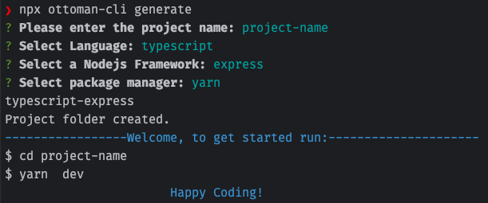

# Ottoman CLI

## Goals:
- Provide some useful tools while working with Ottoman.
- Speed up the Ottoman setup process.
- Help to keep database sync easily in Development and Production environments.
- Automate Ottoman's process.

## Install
```shell
npm install -g ottoman-cli
```

## Usage:
```shell
ottoman-cli generate
```
or
```shell
npx ottoman-cli generate <do not required previous installation>
```

## Commands:
- `generate`
- `migrate`

### Generate command

The Ottoman CLI's `generate` command will bootstrap an Ottoman app for you in no time!
just follow the available steps in the wizard. Happy Coding!

```shell
ottoman-cli generate
```



### Migrate command

```shell
ottoman-cli migrate
```

Ottoman CLI `migrate` command will sync your database with the information took from your models.
Scopes, Collections and Indexes will be created automatically after run the `migrate` command.

Constraints:
1. You should build your app before run the `migrate` command
```shell
npm run build
ottoman-cli migrate
```
2. env variables should point to the built code

Correct
```dotenv
OTTOMAN_CLI_MODEL_PATTERN="dist/**/*.model.js"
```
Incorrect
```dotenv
OTTOMAN_CLI_MODEL_PATTERN="src/**/*.model.ts"
```
3. OTTOMAN_CLI_ENTRY="dist/config/ottoman.js" entry point file should export an `ottoman` instance
```ts
import { Ottoman } from "ottoman";

const ottoman = new Ottoman(...);

export { ottoman };
```
