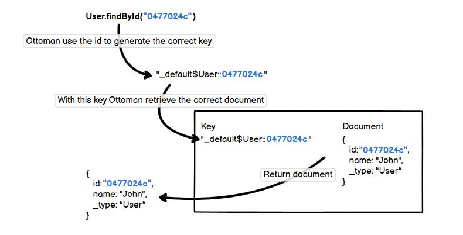

This section is for those who want to understand how Ottoman works in depth.

## Key Generation Layer

Ottoman provides an abstraction layer to handle the `keys` that will be used to store/access the documents on the Database Server.
Developers will only have to work with the `document` ids while ottoman handles the keys automatically for them.

## keyGenerator function

`keyGenerator` function will be used to generate every `key` that Ottoman used.

The default `keyGenerator` function is:
```typescript
const keyGenerator =
    ({metadata, id}) => `${metadata.scopeName}$${metadata.collectionName}::${id}`
```

### Override keyGenerator function

```typescript
const keyGenerator = ({metadata, id}) => `${metadata.collectionName}::${id}`
const User = model('User', schema, { keyGenerator, scopeName: 'myScope' })
```

Now the keys generated for the User Model will be structured in this way:
- `User::0477024c`

If you were using the `keyGenerator` function that `Ottoman` provides by default the result would be:
- `myScope$User::0477024c`

::: tip Notice
When we overwrite the `keyGenerator` function we removed the scopeName, therefore the new keys will not have this information,
they will only have collectionName and id separated by ::
:::

See the example below to understand how `Ottoman` handle the keys using the `keyGenerator` function.

### Defining a `Model`
```typescript
...
const userSchema = new Schema({ name: string });
const User = model('User', userSchema);
```

1. Set your rules in the `Schema`.
2. Now you can create your `Model` with the `Schema` defined.

### Creating a document

Let see how Ottoman handles a new document creation.


::: tip Notice
Using `Ottoman` you only need to think about `id` in order to execute CRUD Operation over documents.
All the `key` management will be automated by `Ottoman`.
:::

### Retrieving a document

Ottoman provides a `findById` method at the `Model` level to retrieve a document by `id`.
See the picture below to understand how it works.




### Caution: While Overwrite keyGenerator

::: danger Danger
There is a real danger when overwriting the `keyGenerator` function. Don't do this if you're not sure what are you doing.

You must ensure 2 things:
1. The result will be always the same for the same inputs.
2. The result will be always distinct for different inputs.

The following cases are bad implementations of `keyGenerator` and Ottoman will don't work as expected.

Case 1: keyGenerator returning always the same value with different inputs.
```typescript
// Assume that the `random` function returns a random integer, for this example, the first execution returns 1234.
const myId = random(); 

const keyGenerator = 
    ({metadata, id}) => `${metadata.collectionName}::${myId}`
// Notice: `myId` is already created then it will have the same value for every execution of `keyGenerator`
// for collectionName `User` it will always return User::1234
```

Case 2: keyGenerator never returns the same value for the same inputs.
```typescript

const keyGenerator =
        ({metadata, id}) => `${metadata.collectionName}::${random()}`
// Now we are using `random()` inside the keyGenerator function, therefore every single execution will return a different value,
// Ottoman will be unable to retrieve documents because the stored document key was `User::1234`,
// but keyGenerator will not return this key anymore.
```
:::