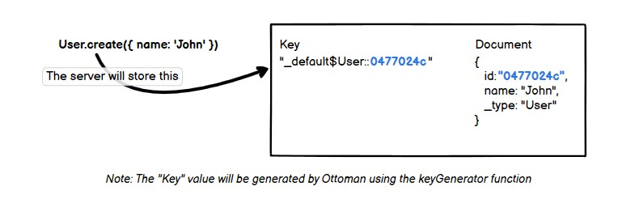
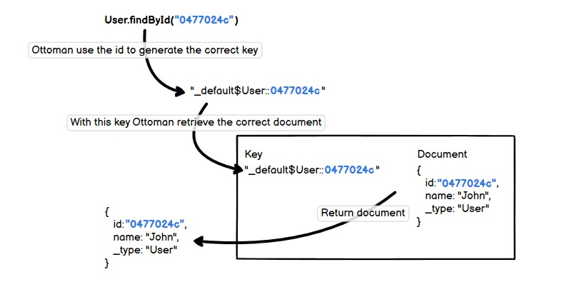

# How Ottoman Works

Some features, especially advanced ones, can benefit from additional explanation and illustration than the basic documentation details. This section is a growing document for those who wish to understand better how Ottoman works in depth.

## Key Generation Layer

Ottoman provides an abstraction layer to handle the `keys` that will be used to store/access the documents on the Database Server.
Developers will only have to work with the `document` ids while ottoman handles the keys automatically for them.

## keyGenerator function

The default `keyGenerator` function is used to generate all `key` by Ottoman in your Couchbase datastore.

```typescript
const keyGenerator =
    ({metadata, id}) => `${metadata.scopeName}$${metadata.collectionName}::${id}`
```

Using the default `keyGenerator` function that `Ottoman` provides, the result of your document key would look something like:

- `myScope$User::0477024c`

### Override keyGenerator function

If you have a use case that requires your keys to be in a certain format, the `keyGenerator` can help you achieve this by overriding it.

```javascript
const keyGenerator = ({metadata, id}) => `${metadata.collectionName}::${id}`
const User = model('User', schema, { keyGenerator, scopeName: 'myScope' })
```

Given you were to use the override example for the `keyGenerator` shown above, the key generated for the same User Model would look like:

- `User::0477024c`

::: Note
In the `keyGenerator` override example above, we removed the scopeName, therefore the new format for keys will not have this information.
:::

Since the default format utilizes the scopename: `myScope` and collectionname: `User` (inherited from `modelName`) in the key, it should be noted that the override example above would only work in Couchbase 7 or Couchbase 6 in "developer preview mode". That is because Couchbase 7 supports named scopes and collection.

For users of Couchbase 6 without "developer preview mode" which enables scopes and collections, the approach would be to set `scopeName` and `collectionName` both to `_default`.

Here is an example of that:

```javascript
const { model, Schema, Ottoman } = require('ottoman')
const ottoman = new Ottoman()

ottoman.connect({ 
  connectionString: 'couchbase://localhost', bucketName: 'travel',
  username: 'Administrator', password: 'password' })

const schema = new Schema({ name: String });
const keyGenerator = ({metadata, id}) => `${metadata.collectionName}::${id}`
const User = model('User', schema, { keyGenerator, scopeName: '_default', collectionName: '_default' })

const createUser = async () => {
  await User.create({ name: 'John' })
}

ottoman.start()
createUser()
  .then(() => console.log('document created'))
  .catch((e) => console.log(e))
```

See the example below to understand how `Ottoman` handles keys using the `keyGenerator` function.

### Defining a `Model`

```javascript
...
const userSchema = new Schema({ name: String });
const User = model('User', userSchema);
```

1. Set your rules in the `Schema`.
2. Now you can create your `Model` with the `Schema` defined.

### Creating a document

Let see how Ottoman handles a new document creation.

```javascript
User.create({name: 'John'})
```



::: tip Notice
Using `Ottoman` you only need to think about `id` in order to execute CRUD Operation over documents.
All the `key` management will be automated by `Ottoman`.
:::

### Retrieving a document

Ottoman provides a `findById` method at the `Model` level to retrieve a document by `id`.
See the picture below to understand how it works.



### Caution: While Overwrite keyGenerator

::: danger Danger
There is a real danger when overwriting the `keyGenerator` function. Don't override it if you're not sure what are you doing and these basic rules are not followed.

You must ensure 2 things:

1. The result will be always the same for the same inputs.
2. The result will be always distinct for different inputs.

The following cases are bad implementations of `keyGenerator` and Ottoman will not work as expected.

Case 1: keyGenerator returning always the same value with different inputs.

```typescript
// Assume that the `random` function returns a random integer, for this example, the first execution returns 1234.
const myId = random(); 

const keyGenerator = 
    ({metadata, id}) => `${metadata.collectionName}::${myId}`
// Notice: `myId` is already created then it will have the same value for every execution of `keyGenerator`
// for collectionName `User` it will always return User::1234
```

Case 2: keyGenerator never returns the same value for the same inputs.

```typescript

const keyGenerator =
    ({metadata, id}) => `${metadata.collectionName}::${random()}`
// Now we are using `random()` inside the keyGenerator function, therefore every single execution will return a different value,
// Ottoman will be unable to retrieve documents because the stored document key was `User::1234`,
// but keyGenerator will not return this key anymore.
```

:::
