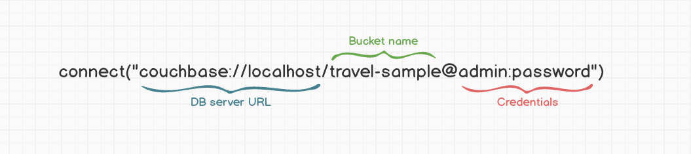

# Connections

Connections are the backbone of Ottoman.js. They are the entry point to use the ODM in your app.
All your [Models](/guides/model) will be created via a connection and map to a Collection.

## Create a connection

You can connect to Couchbase Server with the [connect()](/classes/ottoman.html#connect) method.

```javascript
import { connect } from 'ottoman';
const connection = connect('couchbase://localhost/travel-sample@admin:password');
```

This is the minimum needed to connect to the travel-sample bucket.
If the connection fails on your machine, try using 127.0.0.1 instead of `localhost`.

### Connection String Anatomy




## Connection options  
`connect` function also support a javascript object as parameter.
```javascript
import { connect } from 'ottoman';
const connection = connect({
    connectionString: 'couchbase://localhost',
    bucketName: 'travel-sample',
    username: 'admin',
    password: 'password'
});
```

The available options are:

```typescript
interface ConnectOptions {
  connectionString: string;
  username: string;
  password: string;
  bucketName: string;
  clientCertificate?: string;
  certificateChain?: string;
  transcoder?: unknown;
  logFunc?: unknown;
}
```

## Global config

Ottoman allows you to modify some settings, which could be useful for database modeling or migration,
using the `globalConfig` function you can for example change the metadata key to define collection in documents.

```typescript
import {globalConfig} from "./ottoman";

globalConfig({
    collectionKey: 'type',
  });
```

The `collectionKey` default value is set to `_type`, but maybe you want to change it to `type` as it's described in the example above.

The available configurations are:

```typescript
interface configOptions {
  collectionKey?: string;
  scopeKey?: string;
  defaultScope?: string;
  populateMaxDeep?: number;
  disableScopes?: boolean;
  keyGenerator?: (params: { metadata: ModelMetadata; id: any; }) => string;
}
```

The default implementation for `keyGenerator` function is:
```typescript
KEY_GENERATOR = ({ metadata, id }) => `${metadata.scopeName}$${metadata.collectionName}::${id}`;
```
`keyGenerator` can be override for each `Model` if you want, check this in [model options](/guides/model.html#model-options)

## Using the default connection

```javascript
import { connect, model } from 'ottoman';
// connecting to server, the first successful connection will be set as the default connection
connect('couchbase://localhost/travel-sample@admin:password');

// Now you can use the model function to create Models in the default connection.
const User = model('User', { name: String });
```

## Default connection from environment variable

If the environment variable OTTOMAN_CONNECTION_STRING has a value, Ottoman.js will attempt to connect automatically.

Setting the environment variable in CLI:

```
OTTOMAN_CONNECTION_STRING='couchbase://localhost/travel-sample@admin:password' node index.js
```

Using .env file

```
OTTOMAN_CONNECTION_STRING=couchbase://localhost/travel-sample@admin:password
```

For more details about how to use and configure a .env file, [see this link](https://www.npmjs.com/package/dotenv)

## Multiple connections

```javascript
import { connect, model } from 'ottoman';
const connection1 = connect('couchbase://localhost/travel-sample@admin:password');
const connection2 = connect('couchbase://localhost/other-bucket@admin:password');

// After connect you can create explicitly Model from a given connection

//Creating UserModel from connection1
const UserModel = connection1.model('User', { name: String });

//Creating CatModel from connection2
const CatModel = connection2.model('Cat', { age: Number });
```

## Connections helpers

```javascript
import { getConnections, getDefaultConnection } from 'ottoman';
const connection1 = connect('couchbase://localhost/travel-sample@admin:password');
const connection2 = connect('couchbase://localhost/other-bucket@admin:password');

// Getting default connection
const defaultConnection = getDefaultConnection();
// defaultConnection = connection1;

// Getting all connections
const connections = getConnections();
// connections = [connection1, connection2]
```

The first successful connection will be set as the default connection and 
could be accessed anywhere in your code by calling `getDefaultConnection` function.


All active connections will be stored and could be accessed with the `getConnections` function. 

## Closing connections

```javascript
import { connect, close } from 'ottoman';
const connection1 = connect('couchbase://localhost/travel-sample@admin:password');

// Closing connection1
connection1.close();

// Or just call the `close` function to close default connection. In this case, `connection1` will be closed.
close();
```

::: tip
Always remember to close your connections.
:::

## Next Up

Great job! Now we're connected, let's take a look at [Schemas](/guides/schema).
