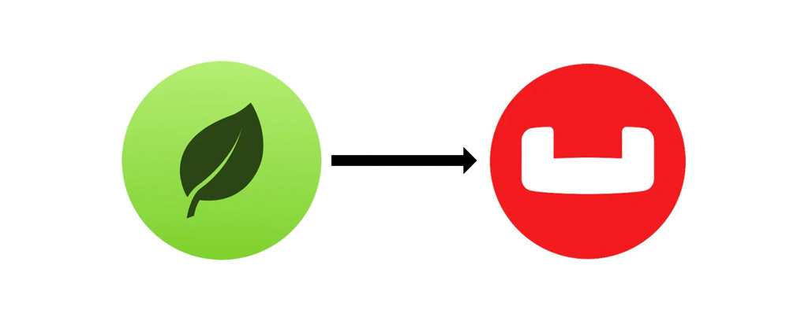

# Mongoose to Ottoman



## Moving Data from MongoDB to Couchbase

In [this post](https://blog.couchbase.com/migrating-data-from-mongodb-to-couchbase/) you will find an extensive explanation that allow you to export the MongoDB data structure, import to Couchbase and make some basic transformations on those documents.

In the following sections we will be looking at some examples of homologous codes between Mongoose and Ottoman that can be useful in the migration process.

## Defining Schema

Everything in Ottoman and Mongoose starts with a Schema.

#### Mongoose

```javascript
import mongoose from 'mongoose';
const { Schema } = mongoose;

const blogSchema = new Schema({
  title: { type: String },
  author: String, // String is shorthand for { type: String }
  body:   String,
  comments: [{ body: String, date: Date }],
  date: { type: Date, default: Date.now },
  hidden: Boolean,
  meta: {
    votes: { type: Number, min: 0, max: 5 },
    favs:  Number
  }
});
```

#### Ottoman

```javascript
import { Schema } from 'ottoman';

const blogSchema = new Schema({
  title: { type: String },
  author: String, // String is shorthand for { type: String }
  body: String,
  comments: [{ body: String, date: Date }],
  date: { type: Date, default: Date.now },
  hidden: Boolean,
  status: { type: String, enum: ['Close', 'Open', 'Review'] },
  meta: {
    votes: { type: Number, min: 0, max: 5 },
    favs: Number,
  }
});
```

## Creating Model

#### Mongoose

```javascript
const Blog = mongoose.model('Blog', blogSchema);
```

#### Ottoman

```javascript
import { model } from 'ottoman';

const Blog = model('Blog', blogSchema);
```

## Connection and Save Model Instance

#### Mongoose

```javascript
import { connect } from 'mongoose';

async function createBlog() {
  await connect('mongodb://localhost:27017/test');

  const blog = new Blog({ name: 'Jane Doe' });

  try {
    const newBlog = await blog.save();
    console.log(`Blog '${ newBlog.title }' successfully created`);
  }
  catch (e) {
    console.log(`ERROR: ${e.message}`);
  }
}

createBlog();
```

#### Ottoman

```javascript
import { connect, start, close } from 'ottoman';

const connection = connect('couchbase://localhost/travel-sample@Administrator:password');

async function createBlog() {
    const blog = new Blog({ name: 'Jane Doe' });

    try {
        await start();
        const newBlog = await blog.save();
        await close();
        console.log(`Blog '${ newBlog.title }' successfully created`);
    }
    catch (e) {
        console.log(`ERROR: ${e.message}`);
    }
}

createBlog();
```

## Instance Methods

#### Mongoose

```javascript
blogSchema.methods.findSimilarTypes = function(cb) {
  return mongoose.model('Blog').find({ type: this.type }, cb);
};

// Now all of our blogs instances have a findSimilarTypes method available to them.
const BlogModel = mongoose.model('Blog', blogSchema);
const newBlog = new BlogModel({ title: 'Blog title' });

const blogs = await newBlog.findSimilarTypes();
console.log(blogs);
```

#### Ottoman

```javascript
blogSchema.methods.findSimilarTypes = function() {
  return connection.getModel('Blog').find({ type: this.type });
};

// Now all of our blogs instances have a findSimilarTypes method available to them.
const BlogModel = model('Blog', blogSchema);
const newBlog = new BlogModel({ title: 'Blog title' });

const blogs = await newBlog.findSimilarTypes();
console.log(blogs);
```

## Statics

#### Mongoose

```javascript
blogSchema.statics.findByTitle = function(title) {
  return this.find({ title: title });
};

const BlogModel = mongoose.model('Blog', blogSchema);
const blogs = await BlogModel.findByTitle(`Some blog's title`);
```

#### Ottoman

```javascript
blogSchema.statics.findByTitle = function(title) {
  return this.find({ title: title });
};

const BlogModel = model('Blog', blogSchema);
const blogs = await BlogModel.findByTitle(`Some blog's title`);
```

## Querying

#### Mongoose

```javascript
BlogModel.find({ title: `Some blog's title` }).exec(callback);
```

#### Ottoman

```javascript
const response = await BlogModel.find({ title: `Some blog's title` });
```

## Deleting

#### Mongoose

```javascript
BlogModel.findByIdAndDelete('id');
```

#### Ottoman

```javascript
const response = await BlogModel.removeById('id');
```

## Updating

#### Mongoose

```javascript
BlogModel.updateOne({ title: `Some blog's title` }, { title: 'New Blog title' }, cb);
```

#### Ottoman

```javascript
const response = await BlogModel.findOneAndUpdate({ title: `Some blog's title` }, { title: 'New Blog title' });
```