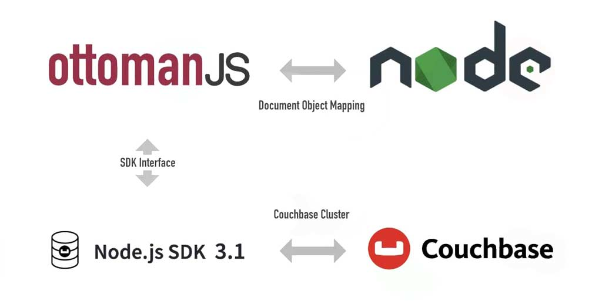

# Ottoman for Couchbase Node.js SDK developers

[Ottoman](/guides/ottoman.html) is an Object Data Modeler (ODM) for Couchbase’s Node.js SDK providing JSON schema and validation for NoSQL.

## Why Use an ODM for Couchbase

With Ottoman, you declare [schema](/guides/schema.html) in your code. Although Couchbase has no schema enforcement for your documents, most applications need some level of schema even in NoSQL. We will explore how to achieve `schema` and validation in NoSQL using Ottoman and Couchbase.

It’s important to validate that documents meet certain requirements before persisting. Although Ottoman creates an abstraction over the Couchbase SDK, the benefits outweigh the drawbacks. A developer creates a lot of logic around creating and updating documents, writing *pre/post* lifecycle, working with data structures, and validation.

## NoSQL Database and Schema Design

An ODM serves a similar role in NoSQL as it does in a relational database, but with additional benefits. Couchbase ***doesn’t*** enforce validation as it is schema-flexible. Ottoman can perform certain checks are being made as your applications persist data. We can warn and error against unwanted data types and formats for individual fields by defining schema and models for various document types.

Your server application code is where a great place to apply business logic and validation. Ottoman’s goal is to provide a better development experience along with giving you control over schema and validation while using Couchbase with Node. We want to give developers a reliable tool to build systems that are easy to design, maintain, and scale.



If you are familiar with Mongoose, an ODM for MongoDB, you will feel pretty comfortable with Ottoman as they have many overlapping features because they both are made for NodeJS and used to model and persist data to a JSON document-oriented key-value database.

In Ottoman, we have many constructs to help define schema and models at the application level. Let’s go over some of the most important terms you need to know in Ottoman.


::: tip Couchbase document example:
```json
{
  "id": 10,
  "type": "hotel",
  "name": "Hotel Kabuki",
  "address": "1625 Post Street",
  "phones": ["321-208-4321", "321-208-1234"]
}
```
:::

## Types

Document properties with the name `type` in Couchbase are near equivalent to **tables** in a relational database. They can help to group different types of JSON documents together for indexing purposes. When using **Secondary Indexes** in Couchbase, we are able to index on any key in the documents. If only 100 of 10,000 documents in your database use a `type` of *‘hotel’*, and you normally want to search for *hotels* based on *city* or *state*, then you might want to build a *Composite Secondary Index* that only needs to search through those hundred documents where *city* or *state* equal a certain value. This is much more efficient than using, for instance, a **Primary Index**.

## Collections

Similar to `types` in Couchbase 6.x (latest Couchbase major version at the time of writing), `collections` will be favored in Couchbase 7 ([already in beta](https://www.couchbase.com/downloads)). In the case you were to use `collections`, you would simply not have a `type` property on each document and instead have the document assigned to a ***‘hotel’*** `collection`.

## Documents

[Documents](/guides/document.html) are comparable to rows of data in a relational database. Traditional RDBMS systems will reference related documents from other tables. You can also do this with a JSON document, however it is suggested to include that information as an embedded document when possible, as we see with the ***hotel*** document’s `phone` number property which is an array of phone numbers. Albeit a very simple example of this, think if you had an `address` property that itself was another JSON object with many properties, you may think this needs to be given its own document, but nesting that information in the parent document in most cases is fine.

## Fields

Also known as attributes, are similar to columns in a relational database and with Ottoman, you can create field-level requirements as part of your schema.

## Schema

While Couchbase is schema-less or schema-flexible, we can still enforce structure at the application level for our documents with [Schemas](/guides/schema.html).

## Model

[Model](/guides/model.html) is a constructor method that takes a `schema` and creates an instance of a `document` equivalent to a single record in a relational database. This *document instance* can be constructed and then persisted to Couchbase by Ottoman [using the `save()` method](/guides/model.html#constructing-documents).

## Getting Started

Let’s get started creating a demo application that we can use to get familiar with Ottoman as an object document mapper.

### Couchbase Installation

Before we get started, let’s set up Couchbase.

You can choose from **one of the following options** (we will be using the first option):

1. [Install Couchbase Server using Docker](https://developer.couchbase.com/docker-image-manual-cb65/)
2. Download Couchbase specific for your OS from the [Couchbase Website](https://www.couchbase.com/downloads)

Let’s navigate through some basics of Ottoman by implementing a model that represents data for a simplified airline example keeping in tradition with Couchbase’s **Travel-Sample** dataset.

Need to have installed on your machine NodeJS and NPM. Next, we will create a blank project and get started writing some code.

### Initializing our Project with NPM

```sh
# Create directory, initialize project & install Ottoman
> mkdir intro-ottoman && cd $_ && npm init -y && npm i ottoman && touch createAirline.js
```

Can use the IDE that is best to your liking and open the created directory `intro-ottoman/`.

### Connection to Couchbase with Ottoman

We will start working out of the file `./createAirline.js` under the project root and add the following (based on the default configuration):

::: tip Connecting to Couchbase in Ottoman
```js
const { Ottoman, model, Schema } = require('ottoman')

const ottoman = new Ottoman({ collectionName: '_default' });
ottoman.connect({
  connectionString: 'couchbase://localhost',
  bucketName: 'travel',
  username: 'Administrator',
  password: 'password'
});
```
:::

Together this imports the `ottoman` package and specifies the `_default` ***collection*** (Couchbase Server 6.x style)

### Ottoman Schema and Models

Models are fancy constructors compiled from [Schema](/guides/schema.html) definitions. An instance of a `model` is called a `document`. [Models](/guides/model.html) in Ottoman help you to easily *create*, *read*, *update*, and *delete* documents in your Couchbase database.

Creating an Ottoman `model` comprises a few things:

### Defining a Document Schema

A `schema` defines `document` properties through an object where the key name corresponds to the property name in the `collection`.

::: tip Create an Airline Schema
```js
const airlineSchema = new Schema({
  callsign: String,
  country: String,
  name: String
});
```
:::

Here we define three properties **(callsign, country, name)** within our `schema`, all of type `String`. By specifying a `type` for each of our `model` properties, maps to an internal validator that will be triggered when the `model` is saved to the database and fail if the data type of the value is not of type `String`.

The following [Schema Types]() are permitted:

- [String](/classes/StringType)
- [Number](/classes/NumberType)
- [Boolean](/classes/BooleanType)
- [Date](/classes/DateType)
- [Array](/classes/ArrayType)
- [Embed](/classes/EmbedType)
- [Reference](/classes/ReferenceType)
- [Mixed](/classes/MixedType)
- *[Custom](/guides/schema.html#custom-schematypes)*

### Defining a Document Model

We need to call the `model` constructor on the `ottoman` instance and pass it the name of the `collection` and a reference to the `schema` definition.

::: tip Create Airline Model
```js
const Airline = ottoman.model('Airline', airlineSchema)
```
:::

When you call the [`model()`](/classes/ottoman.html#model) function it creates a copy of the `schema` and compiles the `model` for you.

Let’s also give the `airlineSchema` a ***phone number*** property. We can add a validation function that will ensure that the value is a valid phone number. Replace the `airlineSchema` section with these three blocks of code:

::: tip Add Validator to Airline Schema
```js
const regx = /^(\([0-9]{3}\)|[0-9]{3}-)[0-9]{3}-[0-9]{4}$/
if ( value && !value.match(regx) ) {
  throw new Error(`Phone Number ${ value } is not valid`)
}

addValidators({
  phone: phoneValidator
})
const airlineSchema = new Schema({
  callsign: String,
  country: String,
  name: String,
  phone: [{ type: String, validator: 'phone' }]
})
```
:::

In the example above, wee see how to create a custom `validator`, we just happen to be using a regular expression as the check-in our validator, just understand that you could have any logic inside one of these validators and in a moment will show you a nice trick to reduce our code down considering we are using regular expression for our matching of the phone numbers.

### Defining Validators

[Validators]() registered with Ottoman (as we have done here with the `ottoman.addValidators()` method) will be called once for every value our document’s property has in the array. If the property did not have an array and instead just a single *String* value, the validator would only be run once. For this reason, I print out the problematic phone number if the validation fails.

There is however an easier way to validate any document properties value so long as the check you are performing uses a regular expression. The [ValidatorOption](/interfaces/ValidatorOption.html#hierarchy') can take a regexp and message as an argument, so we can reduce our code down to:

::: tip Update Schema to use Validator
```js
const regx = /^(\([0-9]{3}\)|[0-9]{3}-)[0-9]{3}-[0-9]{4}$/
const airlineSchema = new Schema({
  callsign: String,
  country: String,
  name: String,
  phone: [{ type: String, validator: { regexp: regx, message: 'phone invalid' } }]
})
```
:::

As you can see, we can do everything we were doing before inline when creating a new `Schema`. But don’t let this keep you from understanding how to create a custom validator, sometimes we need additional logic and that is why the first example is still something worth knowing.

## Basic Document Operations in NoSQL

Most of the basic operations are covered in our Ottoman V2 documentation, we will cover some of that here, but feel free to dive into our [Ottoman V2 (alpha)](/) docs and let us know if there is something that you cannot find or don’t understand.

### Create Documents

Considering the code that we already went over above that creates a `schema`, `model`, and `validators`. *Saving* a `model` and *persisting* it to the database is quite easy. Let’s create a new **Airline** `model` using our `Schema` and then *save/persist* it to the database.

::: tip Create Document & Save to Couchbase
```js
// Constructing our document
const cbAirlines = new Airline({
  callsign: 'CBA',
  country: 'United States',
  name: 'Couchbase Airlines',
  phone: ['321-321-3210', '321-123-1234']
})

// Persist the Couchbase Airlines document to Couchbase Server
const saveDocument = async () => {
  try {
    const result = await cbAirlines.save()
    console.log(result)
  } catch ( error ) {
    throw error
  }
}

// Ensure that all indexes exist on the server
ottoman.start()
  // Next, let's save our document and print a success message 
  .then(async () => {
    saveDocument()
      .then(() => process.exit(0))
      .catch((error) => console.log(error))
  })
```
:::

You may be wondering why we don’t just call the `save()` Document function on its own. Instead, we call it after the `ottoman.start()` is finished. The start method is a shortcut to run `ensureCollections` and `ensureIndexes`. All you have to know for now is that this method makes sure that the proper Ottoman-related indexes have been created on Couchbase and this is important to ensure we can run things like the `find()` method and use tools like the [QueryBuilder]() which we will get to at the end of the article.

At this point, if you were to run all of the code we have written using Node, our `document` would be saved to the database:

```sh
# Run createAirline with Node
> node createAirline.js
```

The result from this operation:

```sh
# Result of Save Airline
_Model {
  callsign: 'CBA',
  country: 'United States',
  name: 'Couchbase Airlines',
  phone: ['321-321-3210', '321-123-1234'],
  id: '2384568f-f1e9-446e-97d1-cad697c40e76',
  _type: 'Airline'
}
```

The following fields are returned:

1. `callsign`, `country`, and `name` fields are all `String`, the most basic value we could have in a `document`.
2. `id` field is auto-generated by Couchbase and is a **unique key**. The ***ID*** value is what you will use in any case to find a `document` with Ottoman in methods like [findById]() or [removeById]()
3. `phone` field is represented by an array and contains valid *phone numbers*.
4. `_type` field can help us to organize our documents like a table does in a relational database, in Couchbase 7, we can use `collections` and `scopes`.

### Validation Errors

If we enter an invalid phone number and run node `createAirline.js` this file again, we would get an error message:

```sh
# Result of Validation Error
ValidationError: Phone Number 321-321-32xx is not valid
```

::: tip Export Schema and Model

You can define your *connection*, *schema*, and *models* in separate files, export, and use them in other files. Create a new file named `airline-schema-model.js` and move our `schema` and `model` definition to it:

```js
const { model, Schema } = require('ottoman')

const regx = /^(\([0-9]{3}\)|[0-9]{3}-)[0-9]{3}-[0-9]{4}$/
const airlineSchema = new Schema({
  callsign: String,
  country: String,
  name: String,
  phone: [{ type: String, validator: { regexp: regx, message: 'phone invalid' } }]
})

// Compile our model using our schema
const Airline = model('Airline', airlineSchema)

exports.airlineSchema = airlineSchema;
exports.Airline = Airline;
```
:::

Now we can create a few new files, `findAirline.js`, `updateAirline.js`, and `removeAirline.js` and populate each file with the following:

::: tip Boilerplate for Multiple Files
```js
const { Ottoman } = require('ottoman')
const ottoman = new Ottoman({ collectionName: '_default' });
ottoman.connect({
  connectionString: 'couchbase://localhost',
  bucketName: 'travel',
  username: 'Administrator',
  password: 'password'
});

const { Airline } = require('./airline-schema-and-model')
```
:::

This will help us to separate some of our code so we are not repeating it in each file and as we go over each of the CRUD operations we can just add some code to each file and our `schema` and `model` will already be imported.

### Find Documents

Let’s try to retrieve the record we saved to the database earlier. The [model class](/classes/model.html) exposes several static and instance methods to perform operations on the database. We will now try to find the record that we created previously using the find method and pass the `callsign` as the search term. Let’s create a new file named `findAirline.js` and we can add the following code:

::: tip Find Airline Document by `callsign`
```js
// Find the Couchbase Airline document by Callsign from Couchbase Server
const findDocument = async () => {
  try {
    Airline.find({ callsign: { $like: 'CBA' } })
      .then((result) => console.log(result.rows));
  } catch ( error ) {
    throw error
  }
}

ottoman.start()
  .then(async () => {
    findDocument()
      .then(() => process.exit(0))
      .catch((error) => console.log(error))
  })
```
:::

Find document result:

```sh
# Result of Find Airline by 'callsign'
[
  _Model {
    _type: 'Airline',
    callsign: 'CBA',
    country: 'United States',
    name: 'Couchbase Airlines',
    phone: ['321-321-3210', '321-123-1234'],
    id: '971045ac-39d8-4e72-8c93-fdaac69aae31',
  }
]
```

### Update Documents

Let’s modify the record above by finding it using the `callsign`, which we can assume that `callsign` will be a unique field in our data, then we can update the `document` all in a single operation.

::: tip Find Airline Document and Update
```js
// Update the Couchbase Airline document by Callsign from Couchbase Server
const findDocumentAndUpdate = async () => {
  const newDocument = {
    callsign: 'CBSA',
    country: 'United States',
    name: 'Couchbase Airways',
    phone: ['321-321-3210', '321-123-1234']
  }
  try {
    let result = await Airline.findOneAndUpdate(
      { callsign: { $like: 'CBA' } }, // filter
      newDocument, // data to update
      { new: true } // find options
    )
    console.log(result)
  } catch ( error ) {
    throw error
  }
}

ottoman.start()
  .then(async () => {
    findDocumentAndUpdate()
      .then(() => process.exit(0))
      .catch((error) => console.log(error))
  })
```
:::

Find document and update result:

```sh
# Result of Find Airline Document and Update
_Model {
  _type: 'Airline',
  callsign: 'CBSA',
  country: 'United States',
  id: '971045ac-39d8-4e72-8c93-fdaac69aae31',
  name: 'Couchbase Airways',
  phone: ['321-321-3210', '321-123-1234']
}
```

### Remove Documents

Ottoman has several methods that deal with removing documents: [remove](/classes/document.html#remove), [removeById](/interfaces/IModel.html#removebyid) and [removeMany](/interfaces/IModel.html#removemany). Considering the many examples we have had so far, each of these should be very easy to understand how to use, so we will just provide a simple example here to show how to remove a `document` that we have already found using the [find](/interfaces/IModel.html#find) method.

::: tip Remove Airline Document by ID
```js
// Remove the Couchbase Airline document by ID from Couchbase Server
const removeDocument = async () => {
  try {
    await Airline.removeById('60e3f517-6a2a-41fe-be45-97081181d675')
      .then((result) => console.log(result))
  } catch ( error ) {
    throw error
  }
}
```
:::

Remove `document` result is a simple [cas value](https://docs.couchbase.com/nodejs-sdk/current/howtos/concurrent-document-mutations.html), used to track changes in Couchbase documents.

```sh
# Result of Remove Airline Document by ID
{ cas: CbCas { '0': <Buffer 00 00 2e 30 62 db 6c 16> } }
```

## Middleware

We have already seen our middleware in action, our `validator` that we initially created can take advantage of middleware using functions that run at specific stages of a pipeline passing control during the execution of asynchronous functions.

### [Available Hooks](/guides/schema.html#hooks)

- validate
- save
- update
- remove

Example of Middleware (a.k.a. [pre](/guides/schema.html#register-hooks-with-pre) and [post](/guides/schema.html#post-hooks) hooks)

Let’s try an example by simply generating a log in the console before and after the creation (`save`) of a `document`, We are going to create a new file called `createWithHooks.js` and most of the code will look familiar except we have added `pre` and `post` hooks that will just report to us the document `name` ***pre-save*** and document `id` ***post-save***:

::: tip Create Document with Pre/Post Save Hooks
```js
const { Ottoman } = require('ottoman')
const ottoman = new Ottoman({ collectionName: '_default' });
ottoman.connect({
  connectionString: 'couchbase://localhost',
  bucketName: 'travel',
  username: 'Administrator',
  password: 'password'
});

const { Airline, airlineSchema } = require('./airline-schema-and-model')

// Plugins and Hooks are middleware, think lifecycle hooks!
const pluginLog = (airlineSchema) => {
  airlineSchema.pre('save', (doc) =>
    console.log(`Doc: ${ doc.name } about to be saved`)
  )
  airlineSchema.post('save', (doc) =>
    console.log(`Doc: ${ doc.id } has been saved`)
  )
};

// Our plugin must be registered before the model creation
airlineSchema.plugin(pluginLog)

// Constructing our document
const cbAirlines = new Airline({
  callsign: 'UNITED',
  country: 'United States',
  name: 'United Airlines',
  phone: ['321-321-3210', '321-123-1234']
})

const saveDocument = async () => {
  try {
    // pre and post hooks will run
    const result = await cbAirlines.save()
    console.log(result)
  } catch ( error ) {
    throw error
  }
}

ottoman.start()
  .then(async () => {
    saveDocument()
      .then(() => process.exit(0))
      .catch((error) => console.log(error))
  })
```
:::

Save document result:

```sh
# Result Save Airline Document
Doc: United Airlines about to be saved
Doc: 1316488a-98ba-4dbb-b0d7-ea6001a0bf57 has been saved
_Model {
  callsign: 'UNITED',
  country: 'United States',
  name: 'United Airlines',
  phone: ['321-321-3210', '321-123-1234'],
  id: '1316488a-98ba-4dbb-b0d7-ea6001a0bf57',
  _type: 'Airline'
}
```

We got our messages before and after the save. With validation, you can ensure certain `document` property values meet your criteria. Tapping into the lifecycle when the `document` is saved, updated, and removed also helped us gain a handle on Ottoman middleware!

## Query Building

Ottoman has a very rich API that handles many complex operations supported by Couchbase and N1QL. Our query builder behind the scenes creates your N1QL statements for you. When using [Query Builder](/guides/query-builder.html#using-the-query-builder) you have three options of which mode to use.

1. [Using parameters](/guides/query-builder.html#build-a-query-by-using-parameters)
2. [Using Access Functions](/guides/query-builder.html#build-a-query-by-using-access-functions)
3. [Using parameters and Access Functions](/guides/query-builder.html#build-a-query-by-using-parameters-and-function-parameters)

In the next three examples, we will do the same thing using each of the three different `QueryBuilder` modes (*params*, *access functions*, and *mixed-mode*). Each example will:

> - *Select* `name` and `country` from ***Airline***
>
> - *Where* the `country` value is “United States”
> 
> - And *LIMIT* our results to 10

Let’s first create a new file named `findWithQueryBuilder.js`, and add the following code:

::: tip Find Airline Document with QueryBuilder
```js
const { Ottoman, Query } = require('ottoman')
const ottoman = new Ottoman({ collectionName: '_default' });

ottoman.connect({
  connectionString: 'couchbase://localhost',
  bucketName: 'travel',
  username: 'Administrator',
  password: 'password'
});

/* Replace with QueryBuilder Example */

const executeQuery = async (query) => {
  try {
    const result = await ottoman.query(query)
    console.log('Query Result: ', result)
  } catch ( error ) {
    throw error
  }
}

generateQuery()
  .then((query) => {
    executeQuery(query)
      .then(() => process.exit(0))
  })
  .catch((error) => console.log(error))
```
:::

This file has a comment in the middle that says: ***“Replace with QueryBuilder Example”***. We can just copy any of the following examples in this section into that area of the file.

### Parameters

::: tip Demonstrate Query Builder using Parameters
```js
const generateQuery = async () => {
  try {
    const params = {
      select: [
        { $field: 'name' },
        { $field: 'country' }
      ],
      where: {
        $and: [
          { country: { $eq: 'United States' } },
          { _type: { $eq: 'Airline' } }
        ]
      },
      limit: 10
    }
    const query = new Query(params, '`travel`').build()
    console.log('Query Generated: ', query)
    return query
  } catch ( error ) {
    throw error
  }
}
```
:::

### Mixed Mode

::: tip Demonstrate Query Builder using Mixed Mode (Parameters & Access Functions)
```js
const generateQuery = async () => {
  try {
    const where = {
      $and: [
        { country: { $eq: 'United States' } },
        { _type: { $eq: 'Airline' } }
      ]
    }
    // pass in our query as a condition expression
    const query = new Query({ where }, '`travel`')
      .select([
        { $field: 'name' },
        { $field: 'country' }
      ])
      .limit(10)
      .build()
    console.log('Query Generated: ', query)
    return query
  } catch ( error ) {
    throw error
  }
}
```
:::

Once you have created a `generateQuery()` function using one of the mixed modes above, you would then need to asynchronously call `generateQuery` and `executeQuery` and the code for that will work with many flavors of the above code:

A result from any of the three modes above:

```sh
# Result of Find Airline Document with QueryBuilder
Query Generated:  SELECT name,country FROM `travel` WHERE (country="United States" AND _type="Airline") LIMIT 10
Query Result:  {
  meta: {
    requestId: '1514fa20-755e-49b3-bbfa-4ed75a1a40ee',
    clientContextId: '0334862c79e727f8',
    status: 'success',
    signature: { country: 'json', name: 'json' },
    profile: undefined,
    metrics: {
      elapsedTime: 6.219,
      executionTime: 5.9619,
      sortCount: undefined,
      resultCount: 2,
      resultSize: 106,
      mutationCount: undefined,
      errorCount: undefined,
      warningCount: undefined
    }
  },
  rows: [
    { country: 'United States', name: 'United Airlines' },
    { country: 'United States', name: 'Jet Blue Airlines' }
  ]
}
```
