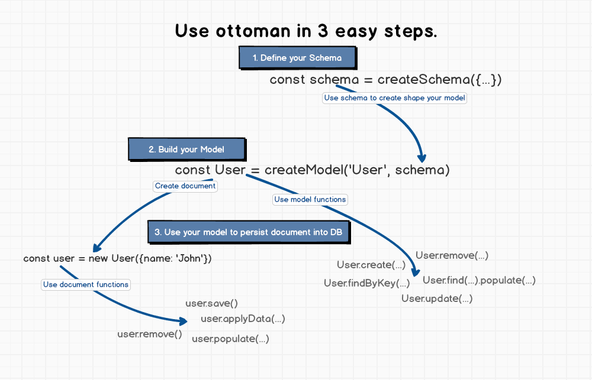

# Schema

Schema maps to a Couchbase collection and defines the shape of the documents within that collection.



## Defining your schema

Everything in Ottoman starts with a Schema. 

```javascript
const blogSchema = new Schema({
  title:  String, // String is shorthand for {type: String}
  author: String,
  body:   String,
  comments: [{ body: String, date: Date }],
  date: { type: Date, default: Date.now },
  hidden: Boolean,
  meta: {
    votes: Number,
    favs:  Number
  }
});
```

Each key in our code blogSchema defines a property in our documents which will be cast to its associated SchemaType. For example, we've defined a property title which will be cast to the String SchemaType and property date which will be cast to a Date SchemaType.

Notice above that if a property only requires a type, it can be specified using a shorthand notation (contrast the title property above with the date property).

Keys may also be assigned to nested objects containing further key/type definitions like the meta property above. 
This will happen whenever a key's value is a POJO that lacks a bona-fide type property. 
In these cases, only the leaves in a tree are given actual paths in the schema (like meta.votes and meta.favs above), and the branches do not have actual paths.
A side-effect of this is that meta above cannot have its own validation. If validation is needed up the tree. A path needs to be created up the tree 
- see the Subdocuments section for more information on how to do this. Also read the Mixed subsection of the SchemaTypes guide for some gotchas.


## Allowed SchemaTypes are:
* [String](/classes/stringtype)
* [Number](/classes/numbertype)
* [Boolean](/classes/booleantype)
* [Date](/classes/datetype)
* [Object](/classes/objecttype)
* [Array](/classes/arraytype)
* Mixed


Schemas not only define the structure of your document and casting of properties,
they also define document instance methods, static Model methods, 
compound indexes, and document lifecycle hooks.


## Creating a model
To use our schema definition, we need to convert our blogSchema into a Model we can work with. 
To do so, we pass it into ottoman.model(modelName, schema):

```javascript
const Blog = model('Blog', blogSchema);
// ready to go!
```

## Instance methods
Instances of Models are documents. Documents have many of their own built-in instance methods. 
We may also define our own custom document instance methods.

```javascript
// define a schema
const animalSchema = new Schema({ name: String, type: String });

// assign a function to the "methods" object of our animalSchema
animalSchema.methods.findSimilarTypes = function() {
return ottoman.model('Animal').find({ type: this.type });
};
```

Now all of our animal instances have a findSimilarTypes method available to them.

```javascript
const Animal = model('Animal', animalSchema);
const dog = new Animal({ type: 'dog' });

const dogs = await dog.findSimilarTypes();
console.log(dogs); // woof
```

* Overwriting a default ottoman document method may lead to unpredictable results.
* The example above uses the Schema.methods object directly to save an instance method. You can also use the Schema.method() helper as described here.
* Do not declare methods using ES6 arrow functions (=>). Arrow functions explicitly prevent binding this, so your method will not have access to the document and the above examples will not work.

## Statics

You can also add static functions to your model. There are two equivalent ways to add a static:

Add a function property to schema.statics
Call the Schema#static() function
```javascript
// Assign a function to the "statics" object of our animalSchema
animalSchema.statics.findByName = function(name) {
  return this.find({ name: new RegExp(name, 'i') });
};
// Or, equivalently, you can call `animalSchema.static()`.
animalSchema.static('findByBreed', function(breed) {
  return this.find({ breed });
});

const Animal = model('Animal', animalSchema);
let animals = await Animal.findByName('fido');
animals = animals.concat(await Animal.findByBreed('Poodle'));
```

Do **not** declare statics using ES6 arrow functions (=>). Arrow functions explicitly prevent binding this,
so the above examples will not work because of the value of this.

to be continued...


## Next Up

Nice, now we'll can see how [Models](/guides/model) works.